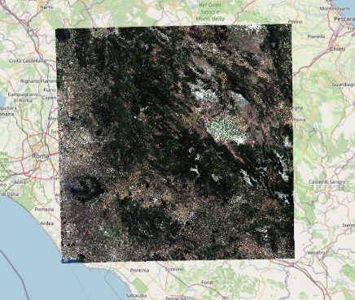
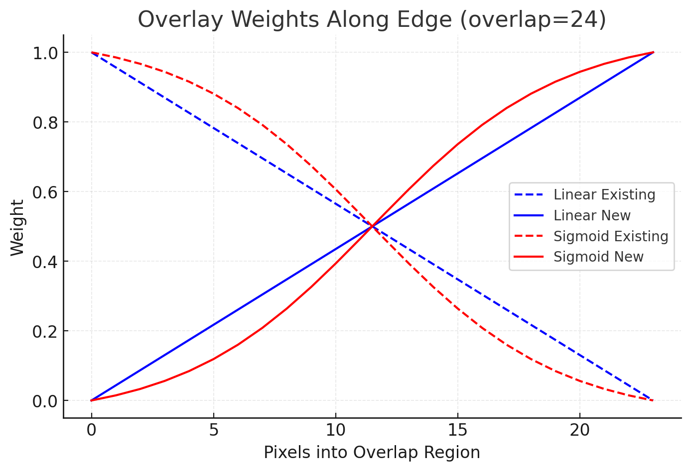
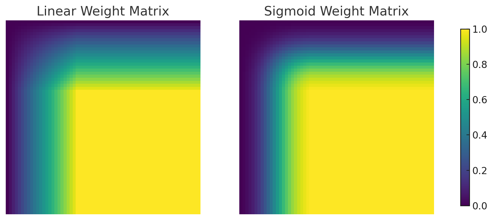
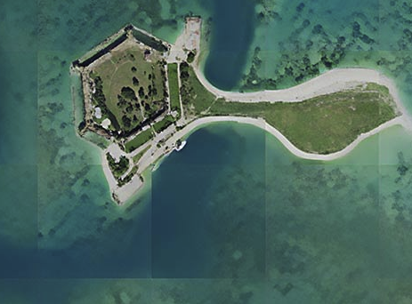

#### 🚀 Fast multi-GPU super-resolution for Sentinel-2 imagery 🌍 — seamless weighted blending ✨ removes patch artifacts, while flexible input support (.SAFE 📂, S2GM 🛰️, GeoTIFF 🗺️) makes generating high-quality SR products effortless.



*Info*   
- This Repo is currently udnergoing major revision
- It is functional for RGB+NIR images currently.
- Functionalities coming in the future:
	- Input many tiles at once
	- Pass more file types
	- Run SR for a selectable amount of bands
    


# Description  
This package performs super-resolution with any PyTorch or PyTorch lighning model for the Sentinel-2 10m bands (R-G-B-NIR).  

### Functionalities: 
- The Input can be either:  
	- a **".SAFE"**
	- a **".SAFE.ZIP"** zipped .SAFE folder, as they come for batched downloads from the OA-Hub
	- a **"S2GM"** folder as available from the S2 Global Mosaic Hub - WARNING: opensr-model does not work w/ mosiacs
	- any **".tif"** file or similar that can be loaded by rasterio (4-band RGB-NIR)
- The following is performed automatically:  
	- Patching of input images by selectable size (eg 128x128)
	- Super-Resolution of individual patches with provided model
	- writing of georeferenced output raster
	- overlapping and sigmoid weightning of patches by selectable pixel amount to reduce patching artifacts - See image
	- CPU, GPU and multi-GPU inference is supported via PL-Lightning
	- logging including example patches and a georef .tif excerpt example form the full SR
- Supported Models:  
	- 'LightningModule': Any PL Lightning model with a .predict() or .forward() function. If this model type is passed, multi-GPU and multi-batch processing is activated, which leads to a significant inference speed increase.
	- 'torch.nn.Module': Any SR model with a .forward() function can be passed. The drawback is that for this model type, multi-GPU and multi-batch processing is not supported. This is therefore considerably slower.


## 🚀 Command-Line Usage

Once installed (`pip install opensr-utils`), you can run the large-file super-resolution pipeline directly from the command line.

### Basic Example
```bash
opensr-run /data/sentinel2_tile.SAFE LDSRS2
```

This command will:

- Take the Sentinel-2 `.SAFE` folder as input  
- Run the **LDSR-S2** model for 4× super-resolution  
- Save outputs in the same directory (with a placeholder `.tif` and temp folder for patches)  

---

### Full Example with Options
```bash
opensr-run /data/flood_scene.tif LDSRS2   --window_size 128 128   --factor 4   --overlap 12   --eliminate_border_px 2   --device cuda   --gpus 0 1   --save_preview
```

**Arguments explained:**
- `root` → Path to the input file or folder (`.tif`, `.SAFE`, or S2GM).  
- `model` → Must be `LDSRS2` for CLI usage (any other value falls back to a no-model pipeline).  
- `--window_size` → Patch size in LR pixels (default: `128 128`).  
- `--factor` → Upscaling factor (default: `4`).  
- `--overlap` → Overlap in pixels to avoid patch seams (default: `8`).  
- `--eliminate_border_px` → Pixels cut at patch edges to reduce artifacts.  
- `--device` → `cpu` or `cuda` (GPU).  
- `--gpus` → List of GPU IDs (e.g. `0 1`).  
- `--save_preview` → Saves LR/SR preview images every 10% of progress.  
- `--debug` → Process only ~100 windows for testing.  

---

### Run as Python Module
You can also execute via Python’s `-m` flag:
```bash
python -m opensr_utils /data/flood_scene.tif LDSRS2 --device cpu
```


## 🚀 Code usage
First, download a .SAFE tile from the Copernicus Browser, a Mosaic folder from S2G, or get your RGB-NIR .tif file ready.

#### 1. install libraries
```sql
pip install opensr-utils
pip install opensr-model
```
#### 2. Create Model - in this case our LDSR-S2 Model
```python
# Instanciate Model
import opensr_model # import pachage
model = opensr_model.SRLatentDiffusion(config, device=device) # create model
model.load_pretrained(config.ckpt_version) # load checkpoint
```
#### 3. Run large-scale Inference

```python

#
import opensr_utils
sr_object = opensr_utils.large_file_processing(
			root=path,                 # File or Folder path
			model=model,               # your SR model
			window_size=(128, 128),    # LR window size for model input
			factor=4,                  # SR factor (10m → 2.5m)
			overlap=12,                # overlapping pixels for mosaic stitching
			eliminate_border_px=2,     # No of discarded border pixels per prediction
			device=device,             # "cuda" for GPU-accelerated inference
			gpus=[1,2,3],                   # pass GPU ID (int) or list of GPUs
			save_preview=True,        # save a low-res preview of the output, and a tif georef
			debug=False,
		)

sr_object.start_super_resolution()
```


## Overlapping Strategy
In order to avoid patching artifacts that are present in many SR products, we perform a weighting based on the distance to the edge of the patches. It can be a linear weighting, but what works best is a sigmoid weight curve which puts leads to a more even edge. Additionally, in order to eliminate edge-artifacts that are present in many SR models, it is also possible to discard a fixed number of pixels along the edges of all patches.



Example of Patching Artifacts in other SR models:  



#### Stats
[](https://pepy.tech/project/opensr-utils)
